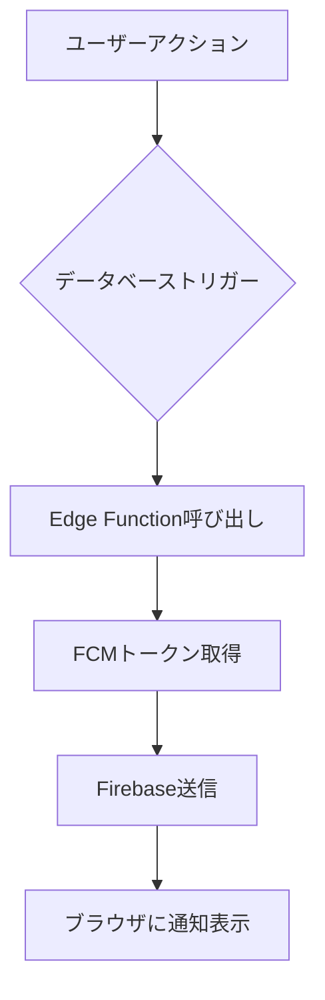

## WebアプリでFirebase FCM + Supabaseを使ったPush通知実装手順（with Edge Functions）

### 【前提】

* 対象: Web SPA（例: Next.js / Vite）
* 使用: Firebase Cloud Messaging（FCM）+ Supabase Edge Function
* 目的: Web Push通知をユーザーに送る

---

## ▶ 1. Firebase (FCM) 準備

### 1-1. Firebase プロジェクト作成

* [https://console.firebase.google.com/](https://console.firebase.google.com/) で新規作成

### 1-2. Cloud Messaging 有効化

* Firebase Console → 機能設定 → "Cloud Messaging"

### 1-3. Webアプリ登録

* \[設定] → "General" → "Your apps" → Webアイコン(スプライトマーク)
* SDK情報 (メモ: `firebaseConfig`)

### 1-4. Web Push公開鍵(VAPID Key) 生成

* \[Project Settings] → Cloud Messaging タブ
* "Web Push certificates" → "Generate key pair"
* 公開鍵を控える

### 1-5. サービスアカウント情報JSONダウンロード

* Project Settings → "Service Accounts" → "Generate new private key"
* supabase Edge Function から HTTP v1 APIを叩くために使用

---

## ▶ 2. Webアプリ側の実装

### 2-1. firebase SDK インストール

```bash
npm install firebase
```

### 2-2. firebase設定 (client.js などに定義) ✅ **完了**

```js
// src/lib/firebase.ts で実装済み
import { initializeApp } from "firebase/app";
import { getMessaging, getToken, onMessage } from "firebase/messaging";

const firebaseConfig = { /* 1-3 で取得した SDK 設定 */ };
const app = initializeApp(firebaseConfig);
export const messaging = getMessaging(app);
```

### 2-3. firebase-messaging-sw\.js 作成（public 直下） ✅ **完了**

```js
// public/firebase-messaging-sw.js で実装済み
importScripts('https://www.gstatic.com/firebasejs/14.9.0/firebase-app-compat.js');
importScripts('https://www.gstatic.com/firebasejs/14.9.0/firebase-messaging-compat.js');

firebase.initializeApp({ /* firebaseConfig をここにも */ });
const messaging = firebase.messaging();
```

### 2-4. 通知トークン取得 ✅ **完了**

```js
// src/lib/firebase.ts と src/hooks/useNotifications.ts で実装済み
const vapidKey = "1-4で取得した公開鍵";
getToken(messaging, { vapidKey }).then((token) => {
  console.log("通知トークン:", token);
});
```

---

## ▶ 3. Supabase Edge Function 側 ✅ **完了**

### 3-1. HTTP v1 で FCM 通知送信 ✅ **完了**

```ts
// supabase/functions/send-notification/index.ts で実装済み
const sendNotification = async (token: string, title: string, body: string) => {
  const message = {
    message: {
      token,
      notification: { title, body },
    },
  };

  const response = await fetch('https://fcm.googleapis.com/v1/projects/<<project-id>>/messages:send', {
    method: 'POST',
    headers: {
      Authorization: `Bearer ${accessToken}`, // service account から生成した token
      'Content-Type': 'application/json',
    },
    body: JSON.stringify(message),
  });

  return await response.json();
};
```

### 3-2. サービスアカウントから accessToken を生成（JWT） ✅ **完了**

* supabase/functions/send-notification/index.ts でJWT生成とOAuth2トークン取得を実装済み

---

## ▶ 4. 通知の送信テスト ✅ **完了**

1. Webアプリ側で通知トークンを取得し Supabase に保存 ✅
2. Edge Function で通知を送信 ✅
3. ブラウザに Push 通知が表示される ✅

## ▶ 🎉 実装完了済み機能

### ✅ 完了した実装:
- **Firebase設定**: `src/lib/firebase.ts`
- **Service Worker**: `public/firebase-messaging-sw.js`  
- **データベース**: FCMトークン保存テーブル (`fcm_tokens`)
- **API エンドポイント**: `/api/notifications/fcm-token`
- **Edge Function**: `supabase/functions/send-notification`
- **React フック**: `src/hooks/useNotifications.ts`
- **UI コンポーネント**: 通知設定画面に統合

### 🔧 次に必要な設定:

#### 1. VAPID Key の設定 (必須)
```bash
# Firebaseコンソール > Project Settings > Cloud Messaging > Web Push certificates
# "Generate key pair" で生成した公開鍵を設定
NEXT_PUBLIC_FIREBASE_VAPID_KEY=YOUR_GENERATED_VAPID_KEY
```

#### 2. マイグレーション実行
```bash
supabase db push
# または
supabase migration up
```

#### 3. Edge Function デプロイ
```bash
supabase functions deploy send-notification
```

### 🚀 使用方法:
1. 設定画面で「通知を有効にする」ボタンをクリック
2. ブラウザの通知権限を許可
3. 「テスト送信」ボタンで動作確認
4. 他のユーザーへの通知は `/functions/v1/send-notification` を呼び出し

## ▶ 🔔 自動通知システム ✅ **完了**

### 自動通知の仕組み：



### 実装された自動通知：

#### 1. **コメント通知** 📝
- **トリガー**: `comments` テーブルへのINSERT
- **条件**: 投稿者 ≠ コメント者
- **通知内容**: 「[投稿タイトル]にコメントが投稿されました」

#### 2. **いいね通知** ❤️
- **トリガー**: `likes` テーブルへのINSERT  
- **条件**: 投稿者 ≠ いいね者
- **通知内容**: 「[投稿タイトル]にいいねが追加されました」

#### 3. **フォロー通知** 👥
- **トリガー**: `follows` テーブルへのINSERT
- **条件**: なし
- **通知内容**: 「あなたをフォローしました」

#### 4. **お知らせ通知** 📢
- **トリガー**: `announcements` テーブルへのINSERT
- **条件**: `notify_users = true`
- **通知内容**: お知らせタイトル

### データベーストリガー設定：

```sql
-- 各テーブルにAFTER INSERTトリガーを設定
CREATE TRIGGER on_comment_insert_notification
  AFTER INSERT ON comments
  FOR EACH ROW
  EXECUTE FUNCTION trigger_comment_notification();

CREATE TRIGGER on_like_insert_notification  
  AFTER INSERT ON likes
  FOR EACH ROW
  EXECUTE FUNCTION trigger_like_notification();

CREATE TRIGGER on_follow_insert_notification
  AFTER INSERT ON follows
  FOR EACH ROW
  EXECUTE FUNCTION trigger_follow_notification();

CREATE TRIGGER on_announcement_insert_notification
  AFTER INSERT ON announcements
  FOR EACH ROW
  EXECUTE FUNCTION trigger_announcement_notification();
```

### 通知無効化：
- ユーザーは設定画面で通知を無効にできます
- 無効にすると FCMトークンが非アクティブ化されます
- 既存のトリガーは動作しますが、通知は送信されません

### セットアップコマンド：
```bash
# 自動セットアップスクリプト実行
chmod +x scripts/setup-notifications.sh
./scripts/setup-notifications.sh
```

---

## ▶ 5. 参考

* [https://firebase.google.com/docs/cloud-messaging/js/client](https://firebase.google.com/docs/cloud-messaging/js/client)
* [https://supabase.com/docs/guides/functions](https://supabase.com/docs/guides/functions)
* [https://firebase.google.com/docs/cloud-messaging/send-message](https://firebase.google.com/docs/cloud-messaging/send-message)
