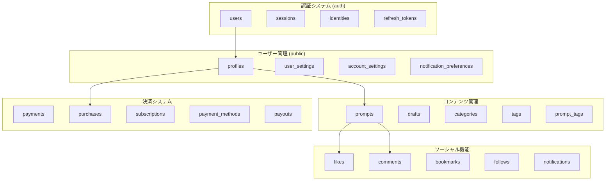

# Prompty データベース設計 完全解説書

## 概要

**Prompty**は、AIプロンプトを共有・販売するためのプラットフォームです。本ドキュメントでは、Supabaseを基盤とした包括的なデータベース設計について詳細に解説します。

### アーキテクチャ概要
- **データベース**: PostgreSQL 15.8.1
- **プロジェクトID**: qrxrulntwojimhhhnwqk
- **リージョン**: ap-northeast-1
- **ステータス**: ACTIVE_HEALTHY

---

## 📊 データベース全体構造



---

## 🔐 認証システム (auth schema)

### 1. users テーブル
**目的**: Supabase認証システムのコアユーザー情報

| カラム名 | データ型 | 説明 |
|---------|---------|------|
| `id` | uuid | ユーザーの一意識別子（プライマリキー） |
| `email` | varchar | ユーザーのメールアドレス |
| `encrypted_password` | varchar | 暗号化されたパスワード |
| `email_confirmed_at` | timestamptz | メール確認日時 |
| `created_at` | timestamptz | アカウント作成日時 |
| `updated_at` | timestamptz | 最終更新日時 |
| `is_super_admin` | boolean | スーパー管理者フラグ |
| `is_sso_user` | boolean | SSO経由ユーザーフラグ |
| `is_anonymous` | boolean | 匿名ユーザーフラグ |

**関連性**: 
- `profiles` テーブルと1:1関係
- 全てのユーザー関連テーブルの基点

### 2. sessions テーブル
**目的**: ユーザーセッション管理

| カラム名 | データ型 | 説明 |
|---------|---------|------|
| `id` | uuid | セッション識別子 |
| `user_id` | uuid | 関連ユーザーID |
| `created_at` | timestamptz | セッション開始時刻 |
| `updated_at` | timestamptz | 最終アクセス時刻 |
| `aal` | aal_level | 認証保証レベル |
| `not_after` | timestamptz | セッション有効期限 |
| `user_agent` | text | ユーザーエージェント情報 |
| `ip` | inet | IPアドレス |

### 3. identities テーブル
**目的**: 外部プロバイダー（Google、Apple等）の認証情報管理

| カラム名 | データ型 | 説明 |
|---------|---------|------|
| `id` | uuid | アイデンティティ識別子 |
| `user_id` | uuid | 関連ユーザーID |
| `provider` | text | プロバイダー名（google、apple等） |
| `provider_id` | text | プロバイダー側のユーザーID |
| `identity_data` | jsonb | プロバイダーから取得した詳細情報 |
| `email` | text | プロバイダーのメールアドレス（生成カラム） |

---

## 👤 ユーザー管理システム

### 4. profiles テーブル
**目的**: ユーザーの公開プロフィール情報

| カラム名 | データ型 | 説明 | 制約 |
|---------|---------|------|-----|
| `id` | uuid | ユーザーID（auth.usersと連携） | PRIMARY KEY |
| `username` | varchar | ユーザー名 | UNIQUE, 3文字以上 |
| `display_name` | varchar | 表示名 | |
| `email` | varchar | 公開メールアドレス | UNIQUE |
| `bio` | text | 自己紹介文 | |
| `avatar_url` | text | アバター画像URL | |
| `banner_url` | text | バナー画像URL | |
| `website` | varchar | ウェブサイトURL | |
| `github` | varchar | GitHubアカウント | |
| `location` | varchar | 所在地 | |
| `is_premium` | boolean | プレミアム会員フラグ | デフォルト: false |
| `premium_until` | timestamptz | プレミアム期限 | |
| `is_business` | boolean | ビジネスアカウントフラグ | デフォルト: false |
| `stripe_account_id` | text | Stripeアカウント連携ID | |
| `status` | text | ユーザーステータス | |

**特徴**:
- RLS（Row Level Security）有効
- 実データ: 17ユーザー登録済み

### 5. user_settings テーブル
**目的**: ユーザーの詳細設定管理

| カラム名 | データ型 | デフォルト値 | 説明 |
|---------|---------|-------------|------|
| `id` | uuid | - | 設定ID |
| `user_id` | uuid | - | ユーザーID（UNIQUE） |
| `account_settings` | jsonb | 複雑なJSONB構造 | アカウント関連設定 |
| `notification_settings` | jsonb | 複雑なJSONB構造 | 通知設定 |
| `reaction_settings` | jsonb | 複雑なJSONB構造 | リアクション設定 |
| `comment_settings` | jsonb | 複雑なJSONB構造 | コメント設定 |

**JSONBフィールド詳細**:

#### account_settings
```json
{
  "use_mincho_font": false,
  "social_connections": {
    "apple": false,
    "google": false,
    "twitter": false
  },
  "accept_tip_payments": true,
  "is_business_account": false,
  "restrict_ai_learning": false,
  "add_mention_when_shared": true,
  "show_recommended_articles": true,
  "invoice_registration_number": null,
  "display_account_on_creator_page": true,
  "allow_introduction_on_official_sns": true,
  "allow_purchase_by_non_registered_users": true
}
```

#### notification_settings
```json
{
  "push_notifications": {
    "likes": true,
    "follows": true,
    "comments": true,
    "mentions": true,
    "new_posts": true,
    "reactions": true
  },
  "email_notifications": {
    "likes": true,
    "follows": true,
    "comments": true,
    "mentions": true,
    "new_posts": true,
    "reactions": true,
    "newsletter": true,
    "promotions": true
  }
}
```

### 6. account_settings テーブル
**目的**: アカウントレベルの基本設定

| カラム名 | データ型 | デフォルト | 説明 |
|---------|---------|-----------|------|
| `user_id` | uuid | - | ユーザーID（UNIQUE） |
| `show_creator_page` | boolean | true | クリエイターページ表示 |
| `add_mentions_on_share` | boolean | true | シェア時メンション追加 |
| `allow_reposts` | boolean | true | リポスト許可 |
| `show_recommended_creators` | boolean | true | おすすめクリエイター表示 |
| `use_serif_font` | boolean | false | セリフフォント使用 |
| `accept_tips` | boolean | true | チップ受け取り許可 |
| `allow_anonymous_purchase` | boolean | true | 匿名購入許可 |
| `opt_out_ai_training` | boolean | false | AI学習データ使用拒否 |

---

## 📝 コンテンツ管理システム

### 7. prompts テーブル
**目的**: プラットフォームのメインコンテンツ（プロンプト）管理

| カラム名 | データ型 | デフォルト | 制約 | 説明 |
|---------|---------|-----------|-----|------|
| `id` | uuid | gen_random_uuid() | PRIMARY KEY | プロンプトID |
| `author_id` | uuid | - | NOT NULL, FOREIGN KEY | 作成者ID |
| `title` | varchar | - | 5文字以上 | プロンプトタイトル |
| `description` | text | - | | プロンプト説明 |
| `content` | text | - | 10文字以上 | プロンプト本文 |
| `thumbnail_url` | text | - | | サムネイル画像URL |
| `category_id` | uuid | - | FOREIGN KEY | カテゴリID |
| `price` | numeric | 0 | | 価格（円） |
| `currency` | text | 'jpy' | | 通貨 |
| `is_free` | boolean | true | | 無料フラグ |
| `is_featured` | boolean | false | | 注目フラグ |
| `is_premium` | boolean | false | | プレミアム限定フラグ |
| `published` | boolean | true | | 公開フラグ |
| `view_count` | integer | 0 | | 閲覧数 |
| `like_count` | smallint | 0 | | いいね数 |
| `preview_lines` | integer | 3 | 1-20 | 有料記事プレビュー行数 |
| `ai_model` | varchar | - | | 使用AIモデル名 |
| `media_type` | varchar | 'image' | | メディアタイプ（image/video） |
| `stripe_product_id` | text | - | | Stripe商品ID |
| `stripe_price_id` | text | - | | Stripe価格ID |

**特徴**:
- 実データ: 20件のプロンプト
- RLS有効でセキュリティ確保
- Stripe連携による決済機能

### 8. drafts テーブル
**目的**: プロンプトの下書き管理

| カラム名 | データ型 | 説明 |
|---------|---------|------|
| `id` | uuid | 下書きID |
| `author_id` | uuid | 作成者ID |
| `title` | varchar | タイトル（nullableで作成途中も保存可能） |
| `description` | text | 説明 |
| `content` | text | 本文 |
| `thumbnail_url` | text | サムネイル |
| `category_id` | uuid | カテゴリID |
| `price` | numeric | 価格 |
| `is_free` | boolean | 無料フラグ |

### 9. categories テーブル
**目的**: プロンプトのカテゴリ階層管理

| カラム名 | データ型 | 制約 | 説明 |
|---------|---------|-----|------|
| `id` | uuid | PRIMARY KEY | カテゴリID |
| `name` | text | NOT NULL | カテゴリ名 |
| `slug` | text | UNIQUE | URLスラッグ |
| `description` | text | | カテゴリ説明 |
| `icon` | text | | アイコン |
| `parent_id` | uuid | FOREIGN KEY | 親カテゴリID（階層構造） |
| `created_by` | uuid | FOREIGN KEY | 作成者ID |

**特徴**:
- 階層構造サポート（parent_id による自己参照）
- 実データ: 13カテゴリ作成済み

### 10. tags テーブル
**目的**: プロンプトのタグ付け機能

| カラム名 | データ型 | 制約 | 説明 |
|---------|---------|-----|------|
| `id` | uuid | PRIMARY KEY | タグID |
| `name` | varchar | UNIQUE | タグ名 |
| `slug` | varchar | UNIQUE | URLスラッグ |

### 11. prompt_tags テーブル
**目的**: プロンプトとタグの多対多関係

| カラム名 | データ型 | 説明 |
|---------|---------|------|
| `id` | uuid | 関係ID |
| `prompt_id` | uuid | プロンプトID |
| `tag_id` | uuid | タグID |

---

## 💝 ソーシャル機能

### 12. likes テーブル
**目的**: プロンプトへの「いいね」機能

| カラム名 | データ型 | 説明 |
|---------|---------|------|
| `id` | uuid | いいねID |
| `user_id` | uuid | いいねしたユーザーID |
| `prompt_id` | uuid | いいねされたプロンプトID |
| `created_at` | timestamptz | いいね日時 |

**特徴**:
- 実データ: 23件のいいね
- user_id + prompt_id で重複防止

### 13. comments テーブル
**目的**: プロンプトへのコメント機能

| カラム名 | データ型 | 制約 | 説明 |
|---------|---------|-----|------|
| `id` | uuid | PRIMARY KEY | コメントID |
| `prompt_id` | uuid | NOT NULL | プロンプトID |
| `user_id` | uuid | NOT NULL | コメント者ID |
| `parent_id` | uuid | FOREIGN KEY | 親コメントID（返信機能） |
| `content` | text | 1文字以上 | コメント内容 |
| `is_edited` | boolean | false | 編集フラグ |

**特徴**:
- 階層構造コメント（返信機能）
- 実データ: 9件のコメント

### 14. bookmarks テーブル
**目的**: プロンプトのブックマーク機能

| カラム名 | データ型 | 説明 |
|---------|---------|------|
| `id` | uuid | ブックマークID |
| `user_id` | uuid | ユーザーID |
| `prompt_id` | uuid | プロンプトID |
| `created_at` | timestamptz | ブックマーク日時 |

### 15. follows テーブル
**目的**: ユーザー間のフォロー機能

| カラム名 | データ型 | 説明 |
|---------|---------|------|
| `id` | uuid | フォロー関係ID |
| `follower_id` | uuid | フォローするユーザーID |
| `following_id` | uuid | フォローされるユーザーID |
| `created_at` | timestamptz | フォロー開始日時 |

**特徴**:
- 実データ: 11件のフォロー関係

### 16. notifications テーブル
**目的**: システム通知管理

| カラム名 | データ型 | 説明 |
|---------|---------|------|
| `id` | uuid | 通知ID |
| `recipient_id` | uuid | 受信者ID |
| `sender_id` | uuid | 送信者ID（システム通知の場合はnull） |
| `type` | varchar | 通知タイプ |
| `content` | text | 通知内容 |
| `resource_type` | varchar | 関連リソースタイプ |
| `resource_id` | uuid | 関連リソースID |
| `is_read` | boolean | 既読フラグ |

---

## 💳 決済システム

### 17. payments テーブル
**目的**: 決済トランザクション管理

| カラム名 | データ型 | 説明 |
|---------|---------|------|
| `id` | uuid | 決済ID |
| `user_id` | uuid | 決済者ID |
| `amount` | bigint | 決済金額（最小単位） |
| `currency` | text | 通貨 |
| `intent_id` | text | Stripe PaymentIntent ID |
| `status` | text | 決済ステータス |

### 18. purchases テーブル
**目的**: プロンプト購入履歴

| カラム名 | データ型 | デフォルト | 説明 |
|---------|---------|-----------|------|
| `id` | uuid | - | 購入ID |
| `buyer_id` | uuid | - | 購入者ID |
| `prompt_id` | uuid | - | 購入プロンプトID |
| `amount` | numeric | - | 購入金額 |
| `currency` | text | 'JPY' | 通貨 |
| `status` | varchar | 'completed' | 購入ステータス |
| `payment_id` | varchar | - | 決済ID |

### 19. subscriptions テーブル
**目的**: サブスクリプション管理

| カラム名 | データ型 | デフォルト | 説明 |
|---------|---------|-----------|------|
| `id` | uuid | - | サブスクリプションID |
| `subscriber_id` | uuid | - | 購読者ID |
| `creator_id` | uuid | - | クリエイターID |
| `status` | varchar | 'active' | ステータス |
| `price_tier_id` | uuid | - | 価格ティアID |
| `current_period_start` | timestamptz | - | 現在期間開始日 |
| `current_period_end` | timestamptz | - | 現在期間終了日 |
| `cancel_at_period_end` | boolean | false | 期間終了時キャンセル |
| `payment_method_id` | uuid | - | 決済方法ID |

### 20. payment_methods テーブル
**目的**: 決済方法管理

| カラム名 | データ型 | 説明 |
|---------|---------|------|
| `id` | uuid | 決済方法ID |
| `user_id` | uuid | ユーザーID |
| `provider` | varchar | 決済プロバイダー |
| `token_id` | varchar | トークンID |
| `card_last4` | varchar | カード下4桁 |
| `card_brand` | varchar | カードブランド |
| `expiry_month` | integer | 有効期限月 |
| `expiry_year` | integer | 有効期限年 |
| `is_default` | boolean | デフォルト決済方法フラグ |

### 21. payouts テーブル
**目的**: クリエイターへの支払い管理

| カラム名 | データ型 | デフォルト | 説明 |
|---------|---------|-----------|------|
| `id` | uuid | - | 支払いID |
| `user_id` | uuid | - | 受取人ID |
| `amount` | numeric | - | 支払い金額 |
| `status` | varchar | 'pending' | 支払いステータス |
| `transaction_id` | varchar | - | トランザクションID |
| `payout_method` | varchar | - | 支払い方法 |
| `notes` | text | - | 備考 |
| `completed_at` | timestamptz | - | 完了日時 |

---

## 📊 アナリティクス・レポート

### 22. analytics_views テーブル
**目的**: プロンプト閲覧履歴の詳細トラッキング

| カラム名 | データ型 | 説明 |
|---------|---------|------|
| `id` | uuid | 閲覧ID |
| `prompt_id` | uuid | プロンプトID |
| `visitor_id` | text | 訪問者識別子（匿名対応） |
| `viewed_at` | timestamptz | 閲覧日時 |

**特徴**:
- 実データ: 85件の閲覧履歴
- 匿名ユーザーも追跡可能

### 23. analytics_summary テーブル
**目的**: 日次アナリティクス集計

| カラム名 | データ型 | デフォルト | 説明 |
|---------|---------|-----------|------|
| `id` | uuid | - | サマリーID |
| `prompt_id` | uuid | - | プロンプトID |
| `date` | date | - | 集計日 |
| `view_count` | integer | 0 | 閲覧数 |
| `unique_viewer_count` | integer | 0 | ユニーク閲覧者数 |
| `like_count` | integer | 0 | いいね数 |
| `comment_count` | integer | 0 | コメント数 |
| `bookmark_count` | integer | 0 | ブックマーク数 |
| `purchase_count` | integer | 0 | 購入数 |

### 24. recently_viewed_prompts テーブル
**目的**: ユーザーの最近閲覧したプロンプト履歴

| カラム名 | データ型 | 説明 |
|---------|---------|------|
| `id` | uuid | 履歴ID |
| `user_id` | uuid | ユーザーID |
| `prompt_id` | uuid | プロンプトID |
| `viewed_at` | timestamptz | 閲覧日時 |

**特徴**:
- 実データ: 101件の閲覧履歴
- パーソナライゼーション機能の基盤

---

## 🛡️ 運営・管理機能

### 25. reports テーブル
**目的**: ユーザーからの報告・通報管理

| カラム名 | データ型 | 制約 | 説明 |
|---------|---------|-----|------|
| `id` | uuid | PRIMARY KEY | 報告ID |
| `target_id` | uuid | NOT NULL | 報告対象ID |
| `target_type` | text | ['comment', 'prompt'] | 報告対象タイプ |
| `prompt_id` | uuid | NOT NULL | 関連プロンプトID |
| `reporter_id` | uuid | NOT NULL | 報告者ID |
| `reason` | text | 制約あり | 報告理由 |
| `details` | text | | 詳細説明 |
| `status` | text | 'pending' | 処理ステータス |

**報告理由の選択肢**:
- `inappropriate`: 不適切なコンテンツ
- `spam`: スパム
- `harassment`: ハラスメント
- `misinformation`: 誤情報
- `other`: その他

### 26. feedback テーブル
**目的**: ユーザーフィードバック・機能要望管理

| カラム名 | データ型 | 説明 |
|---------|---------|------|
| `id` | uuid | フィードバックID |
| `feedback_type` | text | フィードバックタイプ |
| `email` | text | 連絡先メール（任意） |
| `message` | text | フィードバック内容 |
| `is_read` | boolean | 管理者確認フラグ |

**特徴**:
- 実データ: 5件のフィードバック

### 27. contacts テーブル
**目的**: お問い合わせ管理

| カラム名 | データ型 | 説明 |
|---------|---------|------|
| `id` | uuid | お問い合わせID |
| `name` | text | 氏名 |
| `email` | text | メールアドレス |
| `subject` | text | 件名 |
| `message` | text | お問い合わせ内容 |
| `is_read` | boolean | 確認済みフラグ |

**特徴**:
- 実データ: 4件のお問い合わせ

### 28. announcements テーブル
**目的**: システムアナウンス・お知らせ管理

| カラム名 | データ型 | デフォルト | 説明 |
|---------|---------|-----------|------|
| `id` | uuid | - | お知らせID |
| `title` | text | - | タイトル |
| `content` | text | - | お知らせ内容 |
| `icon` | text | - | アイコン |
| `icon_color` | text | - | アイコンカラー |
| `start_date` | timestamptz | now() | 表示開始日 |
| `end_date` | timestamptz | - | 表示終了日 |
| `is_active` | boolean | true | アクティブフラグ |

### 29. announcement_reads テーブル
**目的**: ユーザーごとのお知らせ既読管理

| カラム名 | データ型 | 説明 |
|---------|---------|------|
| `id` | uuid | 既読ID |
| `user_id` | uuid | ユーザーID |
| `announcement_id` | uuid | お知らせID |
| `created_at` | timestamptz | 既読日時 |

**特徴**:
- 複合プライマリキー（user_id + announcement_id）
- 実データ: 35件の既読履歴

---

## 🏆 ゲーミフィケーション

### 30. badges テーブル
**目的**: ユーザーバッジシステム

| カラム名 | データ型 | 制約 | 説明 |
|---------|---------|-----|------|
| `id` | uuid | PRIMARY KEY | バッジID |
| `name` | varchar | UNIQUE | バッジ名 |
| `description` | text | | バッジ説明 |
| `icon` | varchar | | アイコン |
| `requirements` | text | | 獲得条件 |

### 31. user_badges テーブル
**目的**: ユーザーのバッジ獲得履歴

| カラム名 | データ型 | 説明 |
|---------|---------|------|
| `id` | uuid | 獲得ID |
| `user_id` | uuid | ユーザーID |
| `badge_id` | uuid | バッジID |
| `awarded_at` | timestamptz | 獲得日時 |

---

## 📈 サブスクリプション・課金

### 32. price_tiers テーブル
**目的**: クリエイター向け価格プラン管理

| カラム名 | データ型 | デフォルト | 説明 |
|---------|---------|-----------|------|
| `id` | uuid | - | プランID |
| `creator_id` | uuid | - | クリエイターID |
| `name` | varchar | - | プラン名 |
| `description` | text | - | プラン説明 |
| `price` | numeric | - | 価格 |
| `billing_interval` | varchar | 'month' | 課金間隔 |
| `is_active` | boolean | true | アクティブフラグ |
| `benefits` | jsonb | - | 特典内容（JSON） |

### 33. payout_accounts テーブル
**目的**: クリエイターの振込先口座管理

| カラム名 | データ型 | 説明 |
|---------|---------|------|
| `id` | uuid | 口座ID |
| `user_id` | uuid | ユーザーID |
| `account_type` | varchar | 口座種別 |
| `account_holder` | varchar | 口座名義 |
| `account_details` | jsonb | 口座詳細（暗号化対象） |
| `is_default` | boolean | デフォルト口座フラグ |
| `is_verified` | boolean | 確認済みフラグ |

---

## 🔐 セキュリティ・監査

### Row Level Security (RLS)
**適用テーブル**: 全publicスキーマテーブル
- ユーザーは自分のデータのみアクセス可能
- 管理者権限による例外設定

### 監査ログ
**auth.audit_log_entries**: 認証関連の全アクションを記録
- 実データ: 19,527件のログエントリ

### データ暗号化
- パスワード: bcrypt暗号化
- 個人情報: 適切な暗号化実装
- 決済情報: Stripe側で管理

---

## 📊 パフォーマンス統計

### データベース使用量

| テーブル名 | サイズ | 実データ数 | 特記事項 |
|-----------|------|----------|---------|
| auth.audit_log_entries | 6,224 kB | 19,527 | 最大テーブル |
| auth.refresh_tokens | 1,248 kB | 349 | アクティブセッション |
| prompts | 360 kB | 20 | メインコンテンツ |
| analytics_views | 152 kB | 85 | トラッキングデータ |
| likes | 104 kB | 23 | エンゲージメント |

### インデックス戦略
- プライマリキー: UUID使用
- 外部キー: 自動インデックス
- 検索最適化: title, content フィールド
- 時系列クエリ: created_at インデックス

---

## 🚀 システム運用考慮事項

### スケーラビリティ
1. **読み取り最適化**: キャッシュ戦略
2. **書き込み分散**: パーティショニング検討
3. **画像管理**: CDN連携

### バックアップ戦略
1. **日次自動バックアップ**: Supabase標準機能
2. **Point-in-time Recovery**: 7日間保持
3. **災害復旧**: マルチリージョン検討

### 監視・アラート
1. **パフォーマンス監視**: スロークエリ検出
2. **容量監視**: ストレージ使用量
3. **セキュリティ監視**: 異常アクセス検出

---

## 📋 今後の拡張計画

### 機能拡張
1. **AI統合**: より高度なレコメンデーション
2. **国際化**: 多言語対応
3. **API公開**: サードパーティ連携
4. **モバイルアプリ**: ネイティブアプリ対応

### データベース拡張
1. **全文検索**: Elasticsearch連携
2. **リアルタイム機能**: WebSocket対応
3. **アナリティクス強化**: BigQuery連携

---

## 💡 まとめ

**Prompty**のデータベース設計は、現代的なSaaSプラットフォームに必要な機能を包括的にカバーしています：

### 🎯 主要な強み
1. **包括的な機能セット**: 認証からコンテンツ管理、決済まで完備
2. **スケーラブルな設計**: マイクロサービス対応可能な構造
3. **セキュリティファースト**: RLSによる堅牢なアクセス制御
4. **データドリブン**: 詳細なアナリティクス機能
5. **柔軟性**: JSONBによる拡張可能な設定管理

### 🔧 技術的ハイライト
- **PostgreSQL 15.8.1** の最新機能活用
- **Supabase** による認証・リアルタイム機能
- **Stripe** 完全統合による決済システム
- **RLS** による多層セキュリティ
- **JSONB** による柔軟なデータ構造

このデータベース設計により、**Prompty**は高品質なAIプロンプト共有プラットフォームとして、ユーザーに価値を提供し続けることが可能です。 