# Prompty データベース設計 完全解説書 (2025年1月最新版)

## 概要

**Prompty**は、AIプロンプトを共有・販売するためのプラットフォームです。本ドキュメントでは、Supabaseを基盤とした包括的なデータベース設計について詳細に解説します。

### アーキテクチャ概要
- **データベース**: PostgreSQL 15.8.1.070
- **プロジェクトID**: qrxrulntwojimhhhnwqk
- **リージョン**: ap-northeast-1
- **ステータス**: ACTIVE_HEALTHY
- **総テーブル数**: 49テーブル
- **スキーマ**: auth (17テーブル), storage (5テーブル), public (27テーブル)

---

## 📊 データベース全体構造

```mermaid
graph TB
    subgraph "認証システム (auth)"
        A1[users] --- A2[sessions]
        A2 --- A3[refresh_tokens]
        A1 --- A4[identities]
        A1 --- A5[mfa_factors]
        A5 --- A6[mfa_challenges]
        A2 --- A7[mfa_amr_claims]
        A1 --- A8[one_time_tokens]
        A9[flow_state] --- A10[saml_relay_states]
        A11[sso_providers] --- A12[sso_domains]
        A11 --- A13[saml_providers]
    end
    
    subgraph "ストレージ (storage)"
        S1[buckets] --- S2[objects]
        S3[s3_multipart_uploads] --- S4[s3_multipart_uploads_parts]
    end
    
    subgraph "ユーザー管理 (public)"
        B1[profiles] --- B2[user_settings]
        B1 --- B3[account_settings]
        B1 --- B4[notification_preferences]
        B1 --- B5[follows]
    end
    
    subgraph "コンテンツ管理"
        C1[prompts] --- C2[drafts]
        C1 --- C3[categories]
        C4[tags] --- C5[prompt_tags]
        C5 --- C1
        C1 --- C6[recently_viewed_prompts]
    end
    
    subgraph "ソーシャル機能"
        D1[likes] --- C1
        D2[comments] --- C1
        D3[bookmarks] --- C1
        D4[notifications]
    end
    
    subgraph "決済・コマース"
        E1[payments] --- E2[purchases]
        E2 --- C1
        E3[subscriptions] --- E4[payment_methods]
        E5[payouts] --- E6[payout_accounts]
        E7[price_tiers]
    end
    
    subgraph "アナリティクス"
        F1[analytics_views] --- C1
        F2[analytics_summary] --- C1
    end
    
    subgraph "管理・運営"
        G1[reports] --- C1
        G2[feedback]
        G3[contacts]
        G4[announcements] --- G5[announcement_reads]
    end
    
    subgraph "ゲーミフィケーション"
        H1[badges] --- H2[user_badges]
        H2 --- B1
    end
    
    A1 --> B1
    B1 --> C1
    C1 --> D1
    C1 --> D2
    B1 --> E2
```



---

## 🔐 認証システム (auth schema) - 17テーブル

### 1. users テーブル ⭐ コアテーブル
**目的**: Supabase認証システムのメインユーザー情報
**データ数**: 18ユーザー, サイズ: 224 kB

| カラム名 | データ型 | 制約 | 説明 |
|---------|---------|------|------|
| `id` | uuid | PRIMARY KEY | ユーザーの一意識別子 |
| `email` | varchar | | ユーザーのメールアドレス |
| `encrypted_password` | varchar | | 暗号化されたパスワード |
| `email_confirmed_at` | timestamptz | | メール確認日時 |
| `phone` | text | UNIQUE | 電話番号 |
| `phone_confirmed_at` | timestamptz | | 電話番号確認日時 |
| `created_at` | timestamptz | | アカウント作成日時 |
| `updated_at` | timestamptz | | 最終更新日時 |
| `last_sign_in_at` | timestamptz | | 最終ログイン日時 |
| `is_super_admin` | boolean | | スーパー管理者フラグ |
| `is_sso_user` | boolean | NOT NULL | SSO経由ユーザーフラグ |
| `is_anonymous` | boolean | NOT NULL | 匿名ユーザーフラグ |
| `confirmed_at` | timestamptz | GENERATED | メール・電話確認日時の最小値 |
| `email_change_confirm_status` | smallint | CHECK (0-2) | メール変更確認ステータス |
| `banned_until` | timestamptz | | アカウント停止期限 |
| `deleted_at` | timestamptz | | アカウント削除日時 |

### 2. sessions テーブル
**目的**: ユーザーセッション管理
**データ数**: 14セッション, サイズ: 112 kB

| カラム名 | データ型 | 説明 |
|---------|---------|------|
| `id` | uuid | セッション識別子 |
| `user_id` | uuid | 関連ユーザーID |
| `created_at` | timestamptz | セッション開始時刻 |
| `updated_at` | timestamptz | 最終アクセス時刻 |
| `aal` | aal_level | 認証保証レベル (aal1/aal2/aal3) |
| `not_after` | timestamptz | セッション有効期限 |
| `refreshed_at` | timestamp | リフレッシュ日時 |
| `user_agent` | text | ユーザーエージェント情報 |
| `ip` | inet | IPアドレス |
| `tag` | text | セッションタグ |

### 3. refresh_tokens テーブル
**目的**: JWT更新トークン管理
**データ数**: 366トークン, サイズ: 1,248 kB

| カラム名 | データ型 | 説明 |
|---------|---------|------|
| `id` | bigint | トークンID (AUTO INCREMENT) |
| `token` | varchar | リフレッシュトークン (UNIQUE) |
| `user_id` | varchar | ユーザーID |
| `revoked` | boolean | 取り消しフラグ |
| `parent` | varchar | 親トークン |
| `session_id` | uuid | セッションID |

### 4. identities テーブル
**目的**: 外部プロバイダー認証情報管理
**データ数**: 18アイデンティティ, サイズ: 120 kB

| カラム名 | データ型 | 説明 |
|---------|---------|------|
| `id` | uuid | アイデンティティ識別子 |
| `user_id` | uuid | 関連ユーザーID |
| `provider` | text | プロバイダー名 (google, apple等) |
| `provider_id` | text | プロバイダー側ユーザーID |
| `identity_data` | jsonb | プロバイダー詳細情報 |
| `email` | text | プロバイダーメール (GENERATED) |

### 5. mfa_factors テーブル
**目的**: 多要素認証要素管理
**データ数**: 0要素, サイズ: 56 kB

| カラム名 | データ型 | 説明 |
|---------|---------|------|
| `id` | uuid | MFA要素ID |
| `user_id` | uuid | ユーザーID |
| `friendly_name` | text | 表示名 |
| `factor_type` | factor_type | 要素タイプ (totp/webauthn/phone) |
| `status` | factor_status | ステータス (unverified/verified) |
| `secret` | text | シークレットキー |
| `phone` | text | 電話番号 |
| `web_authn_credential` | jsonb | WebAuthn認証情報 |
| `web_authn_aaguid` | uuid | WebAuthn AAGUID |

### 6. mfa_challenges テーブル
**目的**: MFAチャレンジ管理
**データ数**: 0チャレンジ, サイズ: 24 kB

### 7. mfa_amr_claims テーブル
**目的**: 認証方法参照クレーム管理
**データ数**: 14クレーム, サイズ: 80 kB

### 8. audit_log_entries テーブル ⭐ 大容量
**目的**: 認証関連の監査ログ
**データ数**: 19,584エントリ, サイズ: 6,240 kB

| カラム名 | データ型 | 説明 |
|---------|---------|------|
| `id` | uuid | ログエントリID |
| `payload` | json | ログペイロード |
| `created_at` | timestamptz | 作成日時 |
| `ip_address` | varchar | IPアドレス |

### 9-17. その他認証関連テーブル
- **flow_state**: PKCE認証フロー管理 (41エントリ, 120 kB)
- **one_time_tokens**: ワンタイムトークン管理 (0エントリ, 112 kB)
- **sso_providers**: SSO プロバイダー管理
- **sso_domains**: SSOドメイン管理
- **saml_providers**: SAML プロバイダー管理
- **saml_relay_states**: SAML リレー状態管理
- **instances**: インスタンス管理
- **schema_migrations**: 認証スキーママイグレーション (61エントリ, 24 kB)

---

## 💾 ストレージシステム (storage schema) - 5テーブル

### 1. buckets テーブル
**目的**: ストレージバケット管理
**データ数**: 2バケット, サイズ: 48 kB

| カラム名 | データ型 | 説明 |
|---------|---------|------|
| `id` | text | バケットID |
| `name` | text | バケット名 |
| `public` | boolean | パブリックアクセス |
| `file_size_limit` | bigint | ファイルサイズ制限 |
| `allowed_mime_types` | text[] | 許可MIMEタイプ |

### 2. objects テーブル
**目的**: ストレージオブジェクト管理
**データ数**: 123オブジェクト, サイズ: 200 kB

| カラム名 | データ型 | 説明 |
|---------|---------|------|
| `id` | uuid | オブジェクトID |
| `bucket_id` | text | バケットID |
| `name` | text | オブジェクト名 |
| `metadata` | jsonb | メタデータ |
| `path_tokens` | text[] | パストークン (GENERATED) |

### 3-5. その他ストレージテーブル
- **s3_multipart_uploads**: S3マルチパートアップロード管理
- **s3_multipart_uploads_parts**: マルチパートアップロード部分管理
- **migrations**: ストレージマイグレーション (26エントリ, 40 kB)

---

## 👤 ユーザー管理システム (public schema) - 27テーブル

### 1. profiles テーブル ⭐ メインプロフィール
**目的**: ユーザーの公開プロフィール情報
**データ数**: 17プロフィール, サイズ: 64 kB

| カラム名 | データ型 | 制約 | 説明 |
|---------|---------|-----|------|
| `id` | uuid | PRIMARY KEY | ユーザーID (auth.users連携) |
| `username` | varchar | UNIQUE, 3文字以上 | ユーザー名 |
| `display_name` | varchar | | 表示名 |
| `email` | varchar | UNIQUE | 公開メールアドレス |
| `bio` | text | | 自己紹介文 |
| `avatar_url` | text | | アバター画像URL |
| `banner_url` | text | | バナー画像URL |
| `website` | varchar | | ウェブサイトURL |
| `github` | varchar | | GitHubアカウント |
| `location` | varchar | | 所在地 |
| `is_premium` | boolean | デフォルト: false | プレミアム会員フラグ |
| `premium_until` | timestamptz | | プレミアム期限 |
| `is_business` | boolean | デフォルト: false | ビジネスアカウント |
| `stripe_account_id` | text | | Stripeアカウント連携ID |
| `status` | text | | ユーザーステータス (admin等) |

### 2. user_settings テーブル
**目的**: ユーザーの詳細設定管理 (JSONB活用)
**データ数**: 0設定, サイズ: 64 kB

| カラム名 | データ型 | 説明 |
|---------|---------|------|
| `user_id` | uuid | ユーザーID (UNIQUE) |
| `account_settings` | jsonb | アカウント設定 |
| `notification_settings` | jsonb | 通知設定 |
| `reaction_settings` | jsonb | リアクション設定 |
| `comment_settings` | jsonb | コメント設定 |

**JSONBデフォルト構造例**:
```json
{
  "account_settings": {
    "use_mincho_font": false,
    "accept_tip_payments": true,
    "restrict_ai_learning": false,
    "display_account_on_creator_page": true
  },
  "notification_settings": {
    "push_notifications": {"likes": true, "comments": true},
    "email_notifications": {"newsletter": true, "promotions": true}
  }
}
```

### 3. account_settings テーブル
**目的**: アカウントレベルの基本設定
**データ数**: 0設定, サイズ: 24 kB

| カラム名 | データ型 | デフォルト | 説明 |
|---------|---------|-----------|------|
| `user_id` | uuid | - | ユーザーID (UNIQUE) |
| `show_creator_page` | boolean | true | クリエイターページ表示 |
| `add_mentions_on_share` | boolean | true | シェア時メンション追加 |
| `allow_reposts` | boolean | true | リポスト許可 |
| `show_recommended_creators` | boolean | true | おすすめクリエイター表示 |
| `use_serif_font` | boolean | false | セリフフォント使用 |
| `accept_tips` | boolean | true | チップ受け取り許可 |
| `allow_anonymous_purchase` | boolean | true | 匿名購入許可 |
| `opt_out_ai_training` | boolean | false | AI学習データ使用拒否 |

### 4. notification_preferences テーブル
**目的**: 通知設定の詳細管理
**データ数**: 17設定, サイズ: 56 kB

### 5. follows テーブル
**目的**: ユーザー間のフォロー関係
**データ数**: 11フォロー関係, サイズ: 72 kB

| カラム名 | データ型 | 説明 |
|---------|---------|------|
| `id` | uuid | フォロー関係ID |
| `follower_id` | uuid | フォローするユーザー |
| `following_id` | uuid | フォローされるユーザー |
| `created_at` | timestamptz | フォロー開始日時 |

---

## 📝 コンテンツ管理システム

### 6. prompts テーブル ⭐ メインコンテンツ
**目的**: プラットフォームのメインコンテンツ管理
**データ数**: 22プロンプト, サイズ: 360 kB

| カラム名 | データ型 | 制約 | デフォルト | 説明 |
|---------|---------|-----|-----------|------|
| `id` | uuid | PRIMARY KEY | gen_random_uuid() | プロンプトID |
| `author_id` | uuid | NOT NULL, FOREIGN KEY | - | 作成者ID |
| `title` | varchar | 5文字以上 | - | プロンプトタイトル |
| `description` | text | | - | プロンプト説明 |
| `content` | text | 10文字以上 | - | プロンプト本文 |
| `thumbnail_url` | text | | - | サムネイル画像URL |
| `category_id` | uuid | FOREIGN KEY | - | カテゴリID |
| `price` | numeric | | 0 | 価格（円） |
| `currency` | text | | 'jpy' | 通貨 |
| `is_free` | boolean | | true | 無料フラグ |
| `is_featured` | boolean | | false | 注目フラグ |
| `is_premium` | boolean | | false | プレミアム限定 |
| `published` | boolean | | true | 公開フラグ |
| `view_count` | integer | | 0 | 閲覧数 |
| `like_count` | smallint | | 0 | いいね数 |
| `preview_lines` | integer | 1-20制約 | 3 | 有料記事プレビュー行数 |
| `ai_model` | varchar | | - | 使用AIモデル名 |
| `media_type` | varchar | | 'image' | メディアタイプ (image/video) |
| `stripe_product_id` | text | | - | Stripe商品ID |
| `stripe_price_id` | text | | - | Stripe価格ID |
| `stripe_error` | text | | - | Stripeエラー情報 |
| `site_url` | text | | - | サイトURL |
| `prompt_title` | text | | - | プロンプトタイトル |
| `prompt_content` | text | | - | プロンプトコンテンツ |

### 7. drafts テーブル
**目的**: プロンプトの下書き管理
**データ数**: 0下書き, サイズ: 24 kB

### 8. categories テーブル
**目的**: プロンプトのカテゴリ階層管理
**データ数**: 13カテゴリ, サイズ: 96 kB

| カラム名 | データ型 | 制約 | 説明 |
|---------|---------|-----|------|
| `id` | uuid | PRIMARY KEY | カテゴリID |
| `name` | text | NOT NULL, UNIQUE | カテゴリ名 |
| `slug` | text | UNIQUE | URLスラッグ |
| `description` | text | | カテゴリ説明 |
| `icon` | text | | アイコン |
| `parent_id` | uuid | FOREIGN KEY | 親カテゴリ（階層構造） |
| `created_by` | uuid | FOREIGN KEY | 作成者ID |

### 9. tags & prompt_tags テーブル
**目的**: プロンプトのタグ付け機能（多対多関係）
- **tags**: 0タグ, サイズ: 32 kB
- **prompt_tags**: 0関係, サイズ: 32 kB

### 10. recently_viewed_prompts テーブル
**目的**: ユーザーの最近閲覧履歴
**データ数**: 104閲覧履歴, サイズ: 80 kB

---

## 💝 ソーシャル機能

### 11. likes テーブル
**目的**: プロンプトへの「いいね」機能
**データ数**: 23いいね, サイズ: 104 kB

### 12. comments テーブル
**目的**: プロンプトへのコメント（階層構造対応）
**データ数**: 9コメント, サイズ: 80 kB

| カラム名 | データ型 | 制約 | 説明 |
|---------|---------|-----|------|
| `id` | uuid | PRIMARY KEY | コメントID |
| `prompt_id` | uuid | NOT NULL | プロンプトID |
| `user_id` | uuid | NOT NULL | コメント者ID |
| `parent_id` | uuid | FOREIGN KEY | 親コメント（返信機能） |
| `content` | text | 1文字以上 | コメント内容 |
| `is_edited` | boolean | デフォルト: false | 編集フラグ |

### 13. bookmarks テーブル
**目的**: プロンプトのブックマーク機能
**データ数**: 0ブックマーク, サイズ: 72 kB

### 14. notifications テーブル
**目的**: システム通知管理
**データ数**: 0通知, サイズ: 32 kB

---

## 💳 決済・コマースシステム

### 15. payments テーブル
**目的**: 決済トランザクション管理
**データ数**: 0決済, サイズ: 40 kB

| カラム名 | データ型 | 説明 |
|---------|---------|------|
| `id` | uuid | 決済ID |
| `user_id` | uuid | 決済者ID |
| `amount` | bigint | 決済金額（最小単位） |
| `currency` | text | 通貨 |
| `intent_id` | text | Stripe PaymentIntent ID |
| `status` | text | 決済ステータス |

### 16. purchases テーブル
**目的**: プロンプト購入履歴
**データ数**: 0購入, サイズ: 80 kB

### 17. subscriptions テーブル
**目的**: サブスクリプション管理
**データ数**: 0サブスクリプション, サイズ: 32 kB

### 18. payment_methods テーブル
**目的**: 決済方法管理
**データ数**: 0決済方法, サイズ: 8 kB

### 19. payouts & payout_accounts テーブル
**目的**: クリエイター支払い管理
- **payouts**: 0支払い, サイズ: 32 kB
- **payout_accounts**: 0口座, サイズ: 24 kB

### 20. price_tiers テーブル
**目的**: クリエイター向け価格プラン
**データ数**: 0プラン, サイズ: 24 kB

---

## 📊 アナリティクス・レポート

### 21. analytics_views テーブル ⭐ 詳細トラッキング
**目的**: プロンプト閲覧履歴の詳細追跡
**データ数**: 85閲覧, サイズ: 152 kB

| カラム名 | データ型 | 説明 |
|---------|---------|------|
| `id` | uuid | 閲覧ID |
| `prompt_id` | uuid | プロンプトID |
| `visitor_id` | text | 訪問者識別子（匿名対応） |
| `viewed_at` | timestamptz | 閲覧日時 |

### 22. analytics_summary テーブル
**目的**: 日次アナリティクス集計
**データ数**: 0サマリー, サイズ: 32 kB

| カラム名 | データ型 | 説明 |
|---------|---------|------|
| `prompt_id` | uuid | プロンプトID |
| `date` | date | 集計日 |
| `view_count` | integer | 閲覧数 |
| `unique_viewer_count` | integer | ユニーク閲覧者数 |
| `like_count` | integer | いいね数 |
| `comment_count` | integer | コメント数 |
| `bookmark_count` | integer | ブックマーク数 |
| `purchase_count` | integer | 購入数 |

---

## 🛡️ 運営・管理機能

### 23. reports テーブル
**目的**: ユーザーからの報告・通報管理
**データ数**: 0報告, サイズ: 128 kB

| カラム名 | データ型 | 制約 | 説明 |
|---------|---------|-----|------|
| `id` | uuid | PRIMARY KEY | 報告ID |
| `target_id` | uuid | NOT NULL | 報告対象ID |
| `target_type` | text | ['comment', 'prompt'] | 報告対象タイプ |
| `prompt_id` | uuid | NOT NULL | 関連プロンプトID |
| `reporter_id` | uuid | NOT NULL | 報告者ID |
| `reason` | text | 制約あり | 報告理由 |
| `details` | text | | 詳細説明 |
| `status` | text | デフォルト: 'pending' | 処理ステータス |

**報告理由**: inappropriate, spam, harassment, misinformation, other
**処理ステータス**: pending, reviewed, dismissed

### 24. feedback テーブル
**目的**: ユーザーフィードバック・機能要望管理
**データ数**: 5フィードバック, サイズ: 32 kB

### 25. contacts テーブル
**目的**: お問い合わせ管理
**データ数**: 4お問い合わせ, サイズ: 32 kB

### 26. announcements テーブル
**目的**: システムアナウンス・お知らせ管理
**データ数**: 1お知らせ, サイズ: 32 kB

| カラム名 | データ型 | デフォルト | 説明 |
|---------|---------|-----------|------|
| `id` | uuid | - | お知らせID |
| `title` | text | - | タイトル |
| `content` | text | - | お知らせ内容 |
| `icon` | text | - | アイコン |
| `icon_color` | text | - | アイコンカラー |
| `start_date` | timestamptz | now() | 表示開始日 |
| `end_date` | timestamptz | - | 表示終了日 |
| `is_active` | boolean | true | アクティブフラグ |

### 27. announcement_reads テーブル
**目的**: ユーザーごとのお知らせ既読管理
**データ数**: 35既読履歴, サイズ: 56 kB

**特徴**: 複合プライマリキー（user_id + announcement_id）

---

## 🏆 ゲーミフィケーション

### 28. badges & user_badges テーブル
**目的**: ユーザーバッジシステム
- **badges**: 0バッジ, サイズ: 24 kB
- **user_badges**: 0獲得, サイズ: 32 kB

---

## 📈 追加機能テーブル

### 29. prompt_executions テーブル
**目的**: プロンプト実行履歴
**データ数**: 0実行, サイズ: 32 kB

### 30. contests & contest_entries テーブル
**目的**: コンテスト機能
- **contests**: 0コンテスト, サイズ: 16 kB
- **contest_entries**: 0エントリー, サイズ: 40 kB

### 31. magazines & magazine_prompts テーブル
**目的**: マガジン機能
- **magazines**: 0マガジン, サイズ: 24 kB
- **magazine_prompts**: 0関係, サイズ: 32 kB

### 32. notification_settings テーブル
**目的**: 通知設定管理
**データ数**: 0設定, サイズ: 16 kB

---

## 🔐 セキュリティ・監査

### Row Level Security (RLS)
**適用状況**: 全publicスキーマテーブルでRLS有効
- ユーザーは自分のデータのみアクセス可能
- 管理者権限による例外設定
- `is_admin_user()` 関数による管理者権限チェック

### 監査ログ
**auth.audit_log_entries**: 19,584件の認証ログ（6,240 kB）
- ログイン/ログアウト
- パスワード変更
- メール確認
- その他認証イベント

### データ暗号化
- **パスワード**: bcrypt暗号化
- **個人情報**: 適切な暗号化実装
- **決済情報**: Stripe側で安全管理
- **API通信**: HTTPS強制

---

## 📊 パフォーマンス統計（2025年1月現在）

### 上位データベース使用量

| テーブル名 | サイズ | レコード数 | 用途 |
|-----------|------|----------|------|
| auth.audit_log_entries | 6,240 kB | 19,584 | 監査ログ |
| auth.refresh_tokens | 1,248 kB | 366 | セッション管理 |
| prompts | 360 kB | 22 | メインコンテンツ |
| auth.users | 224 kB | 18 | ユーザー情報 |
| storage.objects | 200 kB | 123 | ファイル管理 |
| analytics_views | 152 kB | 85 | 閲覧追跡 |
| reports | 128 kB | 0 | 運営管理 |

### データベース全体統計
- **総データ量**: 約12 MB
- **アクティブユーザー**: 18名
- **セッション数**: 14アクティブ
- **コンテンツ数**: 22プロンプト
- **ソーシャル活動**: 23いいね, 9コメント

### インデックス戦略
- **プライマリキー**: UUID使用（パフォーマンス重視）
- **外部キー**: 自動インデックス生成
- **検索最適化**: title, content フィールドのGINインデックス
- **時系列クエリ**: created_at, viewed_at インデックス
- **複合インデックス**: user_id + prompt_id (重複防止)

### クエリ最適化
- **読み取り重視**: 検索クエリの最適化
- **キャッシュ戦略**: Redis連携検討
- **分析クエリ**: 日次バッチ処理

---

## 🚀 システム運用・スケーラビリティ

### 現在の運用状況
1. **Supabase Managed**: フルマネージド環境
2. **自動バックアップ**: 日次実行
3. **Point-in-time Recovery**: 7日間保持
4. **リアルタイム**: WebSocket接続対応

### スケーラビリティ対策
1. **読み取り最適化**: 
   - Connection Pooling
   - Query Cache
   - CDN連携 (画像・静的ファイル)

2. **書き込み分散**: 
   - テーブルパーティショニング検討
   - 分析データの別DB化

3. **監視・アラート**:
   - Supabase Dashboard
   - パフォーマンスメトリクス
   - 異常検知

### 災害復旧計画
1. **バックアップ戦略**: 
   - 自動日次バックアップ
   - 週次外部バックアップ
   - 本番データの匿名化

2. **冗長化**: 
   - マルチリージョン展開検討
   - フェイルオーバー機能

---

## 📋 今後の拡張計画

### 短期計画（3ヶ月以内）
1. **管理機能強化**: 
   - レポート処理自動化
   - アナリティクスダッシュボード
   - ユーザー管理機能

2. **パフォーマンス改善**:
   - クエリ最適化
   - インデックス調整
   - キャッシュ戦略実装

### 中期計画（6ヶ月以内）
1. **AI機能統合**:
   - プロンプト品質分析
   - レコメンデーション強化
   - 自動タグ付け

2. **国際化対応**:
   - 多言語データベース
   - 地域別設定
   - 通貨対応拡張

### 長期計画（1年以内）
1. **API プラットフォーム化**:
   - 公開API開発
   - サードパーティ連携
   - Webhook システム

2. **エンタープライズ機能**:
   - 組織アカウント
   - 高度な権限管理
   - SLA対応

---

## 💡 設計思想・ベストプラクティス

### データベース設計原則
1. **正規化**: 適切な正規化による重複排除
2. **外部キー制約**: データ整合性保証
3. **UUID使用**: 分散システム対応
4. **JSONB活用**: 柔軟な設定管理
5. **RLS適用**: セキュリティファースト

### 開発・運用指針
1. **マイグレーション管理**: 
   - 段階的データベース変更
   - ロールバック可能設計
   - テスト環境での事前検証

2. **監視・ログ**:
   - 包括的監査ログ
   - パフォーマンス監視
   - セキュリティ監視

3. **データ品質**:
   - 制約による品質保証
   - バリデーション強化
   - 定期的データクリーニング

---

## 🎯 まとめ

**Prompty**のデータベース設計は、現代的なSaaSプラットフォームに必要な全機能を包括的にカバーする、高度に洗練されたシステムです。

### 🔥 主要な強み

#### 1. **包括的機能セット**
- **49テーブル**による完全な機能カバレッジ
- 認証からコンテンツ、決済、分析まで統合
- ゲーミフィケーションと運営機能を完備

#### 2. **企業級セキュリティ**
- **RLS**による多層セキュリティ
- **19,584件**の詳細監査ログ
- 管理者機能の適切な権限分離

#### 3. **スケーラブル設計**
- **PostgreSQL 15.8.1**最新機能活用
- **UUID**による分散システム対応
- **JSONB**による柔軟な拡張性

#### 4. **データドリブン運営**
- 詳細な**アナリティクス機能**
- リアルタイム**ユーザー行動追跡**
- **KPI**監視とレポート機能

#### 5. **運用効率性**
- **Supabase**フルマネージド環境
- 自動バックアップと災害復旧
- 開発・本番環境の分離

### 🚀 技術的ハイライト

- **PostgreSQL 15.8.1.070**: 最新安定版使用
- **Total 49 Tables**: 完全な機能実装
- **RLS Security**: 全publicテーブルで有効
- **Multi-Factor Auth**: TOTP/WebAuthn対応
- **Real-time Features**: WebSocket統合
- **Stripe Integration**: 完全決済システム
- **Advanced Analytics**: 詳細ユーザー分析
- **Content Management**: 階層カテゴリシステム
- **Social Features**: フォロー・いいね・コメント
- **Admin Tools**: 包括的運営機能

このデータベース設計により、**Prompty**は世界最高レベルのAIプロンプト共有プラットフォームとして、ユーザーに最高の価値を提供し、持続的な成長を実現できる強固な基盤を持っています。

---

*更新日: 2025年1月11日*  
*データ取得: Supabase MCP (Project: qrxrulntwojimhhhnwqk)*  
*PostgreSQL Version: 15.8.1.070* 